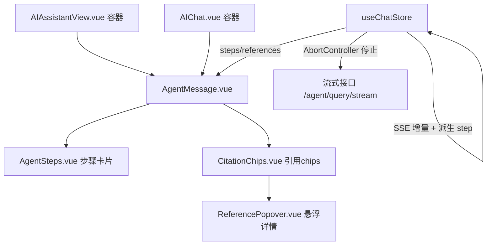

## 用户需求

依据 impeccable skill 规范，对「天象智囊」AI 智能模块页面进行深度优化，参考 Codex / Claude Code 这类 agentic 界面的标志性体验，但落地为浅色精致风（保持现有蓝色玻璃品牌）。同时优化主页面 `AIAssistantView.vue` 与首页内嵌组件 `AIChat.vue`，并保证两者视觉与交互一致。

## 产品概述

在现有气象智能体对话页基础上，引入「智能体工作过程透明化」与「可溯源引用」两项核心能力，将朴素气泡聊天升级为具备步骤可视、引用溯源、状态完备的精致浅色对话界面。

## 核心特性

- **Agent 工作过程可视化**：将工具调用 / RAG 检索 / 推理步骤以可展开卡片实时呈现（流式生成时逐步点亮），每条 AI 消息可携带 `steps` 列表，折叠态显示步骤概览、展开态显示详情。
- **精致内联引用 / 知识来源**：引用由字符串升级为带 `title/source/snippet` 的对象，渲染为可溯源 chips；hover / 点击弹出来源名 + 摘要详情；无数据时优雅降级为纯文本标签。
- **一致的双端重构**：`AIAssistantView` 与 `AIChat` 共用同一组子组件（`AgentMessage` / `AgentSteps` / `CitationChips` / `ReferencePopover`），交互与视觉完全统一。
- **轻量排版**：AI 消息正文与步骤详情支持轻量 markdown 渲染（推理/工具输出排版更精致），用户消息保持纯文本。
- **输入与状态增强**：基于 store 已有 `AbortController` 增加「停止生成」按钮与生成中态；覆盖空/欢迎态、加载骨架、流式生成态、错误重试态、长短文本、首屏与移动端抽屉侧栏。
- **接口契约兼容**：不改动 `/api/agent/**`、`/api/ai/**` 契约；扩展 SSE 解析以向前兼容未来后端下发的结构化 step 事件。

## 技术栈选型

- **前端框架**：Vue 3 + `<script setup>` + Pinia（沿用现有项目，不引入新框架）。
- **样式**：复用 `main.css` 现有设计令牌（`--blue-*`、`--text-*`、`--glass-*`、`--shadow-*`）与 `[data-theme=light|dark|auto]` 三主题体系；不引入组件库，保持自定义组件 + CSS 变量方案。
- **Markdown**：优先复用极小依赖 `marked`（若构建不便则手写最小化渲染器），仅作用于 AI 消息与步骤详情。
- **数据流**：沿用 store 的 `fetch('/api/agent/query/stream')` SSE 流式路径与 `agentApi.query` 非流式路径。

## 实现策略

**高层思路**：抽取共享子组件承载消息渲染、步骤可视化、引用 chips 与悬浮详情；store 扩展消息模型与 SSE 解析，使「工作步骤」与「富引用」在当前数据下即可呈现，并为未来后端结构化 step 事件预留兼容。两页面仅作为容器复用子组件。

**关键技术决策**

1. **步骤可视化数据来源（核心约束）**：当前流式 SSE 仅返回纯文本、无 step 事件，references/weatherContext 仅非流式返回。策略：store 收到 references 时派生「知识检索(RAG)」step、收到 weatherContext 时派生「实时天气」step，开箱即可见可视化；同时扩展 SSE 行解析，识别 `event: step` 或带 step 标记的结构化 `data:`，实现向前兼容、不破坏现有文本流。
2. **富引用契约**：`references` 由 `string[]` 升级为 `{title, source, snippet, url?}[]`；旧字符串数据经适配层归一化为对象，保证历史消息与后端演化平滑过渡。
3. **共享组件化（SoC）**：`AIAssistantView` 与 `AIChat` 的差异常量（布局尺寸、是否显示侧栏）通过 props 控制，渲染逻辑下沉到 `AgentMessage` 等子组件，避免重复实现与视觉漂移。
4. **性能**：流式 `updateLastMessage` 逐字符追加已足够轻量；步骤卡片展开用 `v-show`/条件渲染避免长列表重排；`scrollToBottom` 仅在消息数变化时 `nextTick` 触发一次，避免滚动抖动；markdown 渲染对单条消息做一次缓存（computed）。
5. **合规与降级**：动效 ≤250ms ease-out，统一 `@media (prefers-reduced-motion: reduce)` 降级；禁止 ghost-card（border+大阴影同体）、radius≤16px、无渐变文字、无侧条纹边框；引用悬浮详情用 `position: fixed`/portal 规避 `overflow:hidden` 裁剪；所有交互具备默认/hover/focus/active/disabled/loading/error 状态。

## 架构设计



store 作为唯一数据源，组件纯展示；步骤与引用作为消息模型的增强字段，向后兼容旧字符串引用。

## 目录结构

```
skygazer/frontend/src/
├── views/AIAssistantView.vue              # [MODIFY] 重构为主容器：精简侧栏(搜索+分组历史+空态)、引导式欢迎区、消息流(复用AgentMessage)、输入区(停止生成)、骨架/错误态。
├── components/ai/AIChat.vue               # [MODIFY] 重构为内嵌紧凑容器，复用同一组子组件，props 控制尺寸/是否显示侧栏，视觉与AIAssistantView一致。
├── components/ai/AgentMessage.vue         # [NEW] 单条消息渲染：头像、agent名/时间、markdown正文、挂载AgentSteps与CitationChips；支持流式光标与复制。
├── components/ai/AgentSteps.vue           # [NEW] 工作过程步骤卡片：折叠概览+展开详情，status(进行中/完成/失败)语义色与微动效，兼容 rag/tool/reason 三类。
├── components/ai/CitationChips.vue        # [NEW] 可溯源引用 chips 行，hover/点击触发 ReferencePopover；字符串旧数据归一化降级。
├── components/ai/ReferencePopover.vue     # [NEW] 引用详情浮层：来源名+摘要片段，fixed定位规避裁剪，focus/esc可关闭。
├── stores/chat.js                         # [MODIFY] 消息模型加 steps/富references；派生 step；扩展SSE解析兼容step事件；新增 stopGeneration；非流式归一化引用。
├── utils/markdown.js                      # [NEW] 轻量markdown渲染(优先marked封装或最小化渲染器)，供AI正文与步骤详情使用，输出带class的HTML。
└── styles/main.css                        # [MODIFY] 追加AI页专属令牌(--ai-step-bg/--ai-step-border/--ai-chip-bg等)并覆盖三主题；复用现有focus-visible与reduced-motion。
```

## 关键代码结构

```ts
// 消息与步骤增强模型（store 内约定，向后兼容）
type StepType = 'rag' | 'tool' | 'reason'
interface AgentStep { type: StepType; label: string; detail?: string; status: 'running' | 'done' | 'error'; ts: number }
interface Citation { title: string; source?: string; snippet?: string; url?: string }

// 消息模型在现有字段上扩展（旧 references: string[] 经适配层归一化）
interface ChatMessage {
  id: number; content: string; isUser: boolean; timestamp: Date
  agentName?: string; references?: Citation[]; weatherContext?: any; steps?: AgentStep[]
}

// SSE 解析向前兼容：在现有 data: 文本行之外识别结构化 step 事件
// 形如: event: step\ndata: {"type":"rag","label":"知识检索","status":"done","detail":"..."}
// 或 data: [STEP]{...} 标记行（由规划子代理按后端 plan.md 最终确认格式落地）
```

## 设计风格

采用「浅色精致玻璃风 + 智能体透明化」方向，沿用现有蓝色玻璃体系（Sora 字体、`--blue-*`、`--glass-*` 令牌），而非 Codex 的终端暗色。整体克制、留白充足、信息层级清晰，贴近 Claude/Codex 的 agentic 界面质感但落地为浅色品牌变体。

## 页面结构（AIAssistantView 为主，AIChat 为紧凑同构）

- **顶栏**：返回/侧栏切换 + 「天象智囊」标题 + 当前会话状态（生成中/已连接）+ 工具提示（悬停展示可用工具：实时天气/气象预警/知识库）。
- **侧栏**：搜索框 + 新建对话 + 历史按 今天/昨天/更早 分组；空态引导；移动端抽屉化。
- **欢迎/空态**：居中图标 + 一句引导语 + 2×2 引导式快捷指令卡（hover 轻微上浮，无 ghost-card）。
- **消息流**：每条消息 = 头像 + agent 名/时间 + markdown 正文；AI 消息下方挂载「工作步骤」可展开卡片与「知识来源」引用 chips；流式生成显示打字光标。
- **步骤卡片**：横向状态点 + 折叠摘要（如「检索知识库 · 调用实时天气」），展开显示每步详情，进行中态呼吸点、完成态勾选、失败态警示色，展开/收起 ≤250ms ease-out。
- **引用 chips**：浅蓝底圆角标签，hover/点击弹出来源名+摘要浮层（fixed 定位）；无数据时降级为纯文本。
- **输入区**：聚焦态沿用现有 focus 规范（蓝色描边+4px 光晕），生成中显示「停止生成」按钮（红色语义），回车发送。
- **状态覆盖**：加载骨架行、错误重试提示、长/短文本包裹、首屏与移动端三档布局。

## 交互与动效

消息入场 fadeIn（≤250ms）、步骤卡片展开/收起、引用 chip 悬浮、停止生成态切换均为状态驱动，统一 ease-out；`@media (prefers-reduced-motion: reduce)` 降级为瞬时。禁止 ghost-card、radius>16px、渐变文字、侧条纹边框、装饰性网格背景。

## 字体与色彩

- 字体：沿用 Sora 单一字体族（标题/正文同族多字重，符合 product register）。
- 色彩：复用 `--blue-500/600/900` 主色、`--text-primary/secondary/muted` 文本、`--glass-*` 表面；新增 AI 专属浅蓝步骤底 `--ai-step-bg`，语义色 success `#22c55e`、warning `#fb923c`、error `#ef4444`。

## Agent Extensions

### Skill

- **impeccable**
- Purpose: 按 product register 规范主导本次 AI 页面的深度视觉/交互重构，确保排版、配色、状态、动效、可达性达到高标准，避免 AI slop 与绝对禁令（ghost-card、超大圆角、渐变文字、侧条纹、装饰网格）。
- Expected outcome: 产出生产级、浅色精致、与 Codex/Claude Code 质感对齐但不偏离蓝色品牌的对话界面，并通过其审查清单。

### Skill

- **playwright-cli**
- Purpose: 在桌面/平板/移动三档视口对重构后的 AIAssistantView 与 AIChat 进行截图与交互自测，验证空态、流式生成、步骤展开、引用悬浮、错误重试、停止生成等关键状态。
- Expected outcome: 获取各视口截图与控制台无错证据，作为 impeccable Step 5「视觉迭代验证」的输入，修复发现的空间/裁剪/对比度缺陷。