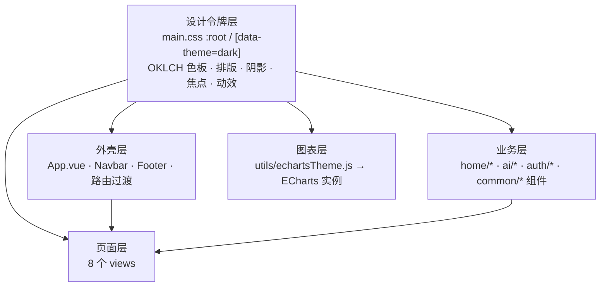

## 用户需求

作为一个前端开发与设计师，希望调用 `impeccable` 技能，对「智观天象 AI 智能气象决策系统」前端项目进行**全站页面风格全面优化**，建立突破常规、与众不同的专属视觉签名（强烈配色 + 个性化排版与动效）。

经澄清确认的三项关键决策：

1. **风格基调**：大胆独特，建立专属视觉签名（非通用玻璃拟态 / 非 Tailwind 默认蓝）。
2. **覆盖范围**：全站统一优化——8 个页面视图 + 全部 18 个组件 + 全局设计令牌。
3. **主题策略**：本次聚焦**默认深色**做精做透；浅色主题作为后续任务，不在本次范围（但需保证结构不破坏）。

## 产品概述

一套基于 Vue 3 的 AI 天气决策系统（含实时天气、小时预报、生活指数、地图、AI 助手、个人中心、设置等模块）。本次重做将把现有「浅色天蓝渐变 + 玻璃拟态 + 通用蓝」的 AI 套路设计，改造为**深色「气象指挥中心」**式的专属视觉系统：深空底色 + 极光青信号色 + 等宽数据点 + 克制而精密的层次与动效。

## 核心特性

- **全新设计令牌系统**：以 OKLCH 定义深色优先签名色板（深空底 / 极光青主色 / 暖琥珀警示色）、排版阶梯、阴影、焦点环、`prefers-reduced-motion` 降级，默认深色。
- **去玻璃拟态化**：将 18 处 `.glass-card` 默认磨砂卡替换为实体抬升面板（单描边或单阴影，不叠加），仅在弹窗/浮层保留有目的的玻璃。
- **命令中心式外壳**：导航栏、底部栏、路由过渡采用精密、克制的动效与信号指示。
- **专属排版签名**：Sora 几何无衬线作显示字，叠加等宽字体呈现气象数据（tabular 数字），形成科技精密感对比轴。
- **天气态主题着色**：`data-weather` 驱动主色相（晴=极光青、雨=紫、云=岩灰、风暴=琥珀），作为产品级签名特性。
- **ECharts 统一深色换肤**：集中注册图表主题，网格/坐标轴/提示框/强调色同步新令牌。
- **全站可读性与响应式打磨**：正文对比度 ≥4.5:1，移动端标题不溢出，动效 ease-out 指数曲线且无 bounce。

## 技术栈选择

- **沿用现有栈**：Vue 3.4 + Vite 5 + Pinia + vue-router 4 + ECharts 5，避免引入新框架。
- **字体增强**：保留 `@fontsource/sora`（显示/UI），新增一款等宽字体（如 `@fontsource/jetbrains-mono` 或 `@fontsource/space-mono`）用于气象数据点，形成几何无衬线 + 等宽的技术对比轴（符合 impeccable 排版对比原则）。
- **色彩系统**：以 OKLCH 心智定义签名色板，落到 CSS 自定义属性；默认 `[data-theme="dark"]`，浅色选择器保留结构但本次不精修。
- **可视化**：ECharts 注册集中式深色主题（`src/utils/echartsTheme.js`），组件引用统一主题名。

## 实现方案

### 总体策略

以「设计令牌层 → 外壳层 → 业务组件/页面层 → 图表层 → 审查打磨层」自下而上重构。先在 `main.css` 落地深色优先的签名令牌与去玻璃的实体表面工具类（`.surface` / `.panel`），再逐层替换 18 个组件与 8 个页面的视觉；最后用 impeccable 技能做 audit/polish/animate 收口。

### 关键技术决策与权衡

- **去玻璃拟态**：玻璃 `backdrop-filter` 在 18 个组件中普遍使用，既属 AI 套路也存在合成开销。改为实体抬升面板（背景 + 1px 低对比描边，或 ≤8px 模糊的单阴影，**两者不叠加**），视觉更稳、性能更佳；仅 `AuthModal`/`LoginPrompt` 等浮层保留有目的的玻璃。
- **签名色板（Committed 策略）**：深空底 `#0B0F1A` 承载氛围，极光青 `#34E3E0` 作信号主色（导航激活、焦点、图表强调、天气态），暖琥珀 `#FF9F45` 作警示/人文暖色。规避技能标记的「奶油/天蓝浅色带」与「Tailwind 默认蓝」两套 AI 默认。
- **天气态着色**：复用现有 `data-weather` 属性，仅调整其驱动的主色相令牌，作为低成本高辨识度的产品签名，不新增数据流。
- **等宽数据点**：气象温度/湿度/风速等数值用等宽 + `font-variant-numeric: tabular-nums`，建立「指挥中心」精密感，且不改变布局。

### 性能与可靠性

- 移除大面积 `backdrop-filter`，降低合成层开销；过渡仅用 `transform`/`opacity`，避免触发布局重排。
- 主题/天气切换过渡统一缓动，时长 ≤0.4s，避免 0.6s 长过渡带来的拖沓。
- 所有入场动效均作用于「默认已可见」的内容（不依赖 class 触发隐藏再显现），并带 `prefers-reduced-motion` 降级为瞬时/淡入。
- 不动业务逻辑与 API/store，仅改模板类与样式，控制爆炸半径。

## 实现注意

- **避免回归**：保留 `.glass-card`/`.glass-nav` 类定义但缩小用途（仅浮层）；新增 `.surface`/`.panel` 工具类供组件迁移，不删除旧类以免其他文件断链。
- **对比度核查**：`--text-secondary`(#9FB0CC)、`--text-muted`(#6B7A99) 仅用于大字号/装饰，正文用 `--text-primary`(#EAF2FF) 保证 ≥4.5:1。
- **ECharts 主题**：集中注册一次，组件 `init(chart, 'skygazer-dark')` 引用，避免每图复制配色。
- **日志/无副作用**：纯前端视觉改动，不引入 console 噪音与随机性。

## 架构设计

设计系统分层（令牌驱动、外壳消费、页面/组件复用、图表统一换肤）：



## 目录结构与改动清单

```
skygazer/frontend/
├── index.html                         # [MODIFY] 默认 data-theme=dark、theme-color 改为深空色、添加等宽字体 preconnect
├── src/
│   ├── main.js                        # [MODIFY] 引入等宽字体（jetbrains-mono 400/500/700）
│   ├── App.vue                        # [MODIFY] 布局留白节奏、路由过渡动效（fade+微位移，reduced-motion 降级）
│   ├── styles/
│   │   └── main.css                   # [MODIFY] 核心：重写 :root 与 [data-theme=dark] 签名令牌；新增 .surface/.panel 实体面工具类；重定义天气态色相；清理装饰性 float/breathe 默认；强化 reduced-motion
│   ├── utils/
│   │   └── echartsTheme.js            # [NEW] 集中注册 ECharts 深色主题（网格/轴/tooltip/强调色同步令牌）
│   ├── components/
│   │   ├── common/
│   │   │   ├── Navbar.vue             # [MODIFY] 实体导航条 + 极光青激活指示 + 信号感分隔
│   │   │   ├── Footer.vue             # [MODIFY] 实体底栏，弱化渐变
│   │   │   ├── Breadcrumb.vue         # [MODIFY] 替换为实体分隔样式
│   │   │   ├── EmptyState.vue         # [MODIFY] 实体卡片 + 克制插画替代
│   │   │   ├── ErrorState.vue         # [MODIFY] 同上，语义色统一
│   │   │   └── Icon.vue               # [MODIFY] 描边色同步令牌
│   │   ├── home/
│   │   │   ├── WeatherHero.vue        # [MODIFY] 签名 Hero：强对比标题 + 等宽大数字 + 天气态辉光
│   │   │   ├── MetricsGrid.vue        # [MODIFY] 实体指标面板，去除 hero-metric 套路
│   │   │   ├── HourlyForecast.vue     # [MODIFY] 实体时间轴卡片
│   │   │   ├── LifestyleCards.vue     # [MODIFY] 去玻璃、统一卡片节奏
│   │   │   └── CitySelector.vue       # [MODIFY] 实体下拉/选择器，portal 防裁剪
│   │   ├── ai/
│   │   │   ├── AIChat.vue             # [MODIFY] 实体对话面 + 有目的玻璃仅用于气泡浮层
│   │   │   └── (ai 子目录其余组件)      # [MODIFY] 同步实体面与信号色
│   │   ├── auth/
│   │   │   ├── AuthModal.vue          # [MODIFY] 唯一保留有目的玻璃的浮层；强化焦点与对比
│   │   │   └── LoginPrompt.vue        # [MODIFY] 同上
│   │   └── charts/
│   │       └── (各 ECharts 组件)       # [MODIFY] 改用集中注册的深色主题
│   └── views/
│       ├── HomeView.vue               # [MODIFY] 页面级留白/节奏/标题层级
│       ├── AnalysisView.vue           # [MODIFY] 同上 + 图表容器实体化
│       ├── LifestyleView.vue          # [MODIFY] 同上
│       ├── MapView.vue                # [MODIFY] 同上（地图浮层信号色）
│       ├── AIAssistantView.vue        # [MODIFY] 同上
│       ├── ProfileView.vue            # [MODIFY] 同上
│       ├── SettingsView.vue           # [MODIFY] 表单控件实体化、焦点环统一
│       └── ThemeSettings.vue          # [MODIFY] 主题预览卡重做（深色优先）
```

## 设计风格

采用**深色「气象指挥中心」**美学，建立突破常规的专属视觉签名。

- **基调与场景**：用户在低照度的控制室/夜间场景中使用决策系统，需要高信息密度且克制专注的界面——深色底承载氛围，极光青作为「信号」主色贯穿导航、焦点与数据强调，暖琥珀仅用于警示与人文暖意。
- **布局**：以语义化 z-index 与清晰分层构建秩序；卡片仅作真正最佳承载时使用，避免嵌套卡；栅格用 `repeat(auto-fit, minmax(280px,1fr))` 自适应；间距按节奏变化而非均匀。
- **色彩**：深空底 `#0B0F1A`、抬升面 `#141B2D`/`#1B2438`；极光青 `#34E3E0` 主色、暖琥珀 `#FF9F45` 警示；文本 `#EAF2FF`/`#9FB0CC`。天气态（`data-weather`）微调车身体色相，作为产品级签名。
- **排版**：Sora（几何无衬线，800/700 显示、600 副标题、400 正文）+ 等宽字体（tabular 数字）体现气象数据的精密感；标题 `text-wrap: balance`、字距 ≥ -0.03em，clamp 上限 ≤ 4rem 防溢出。
- **交互与动效**：ease-out 指数曲线揭示（fade + 微位移），无 bounce/elastic；按钮/卡片聚焦用极光青环；`prefers-reduced-motion` 降级为瞬时/淡入；天气态切换带平滑色相过渡。
- **去 AI 套路**：禁用渐变文字、侧条边框、每 section 全大写 eyebrow、01/02/03 编号 scaffold、装饰性网格/条纹背景、手绘 SVG；玻璃仅用于弹窗浮层。

## 使用的扩展

### Skill

- **impeccable**
- 用途：在收口阶段对全站做 `audit`（a11y/对比度/响应式/性能）、`polish`（最终质量）、`animate`（有目的动效）以及 AI slop 反套路核查，确保结果达到生产级、无 AI 套路。
- 预期结果：输出可读性/对比度/动效清单并就地修复，页面通过 impeccable 反套路审查，深色主题视觉统一且具专属签名。

### SubAgent

- **code-explorer**
- 用途：在执行第一步前，跨 18 个组件与 8 个页面批量定位所有 `.glass-card`/`.glass-nav`/`--blue-*`/`backdrop-filter` 等旧令牌与玻璃类引用，生成精确迁移清单，避免遗漏。
- 预期结果：产出完整的待改文件与具体引用点清单，保证去玻璃化迁移零遗漏、无断链。