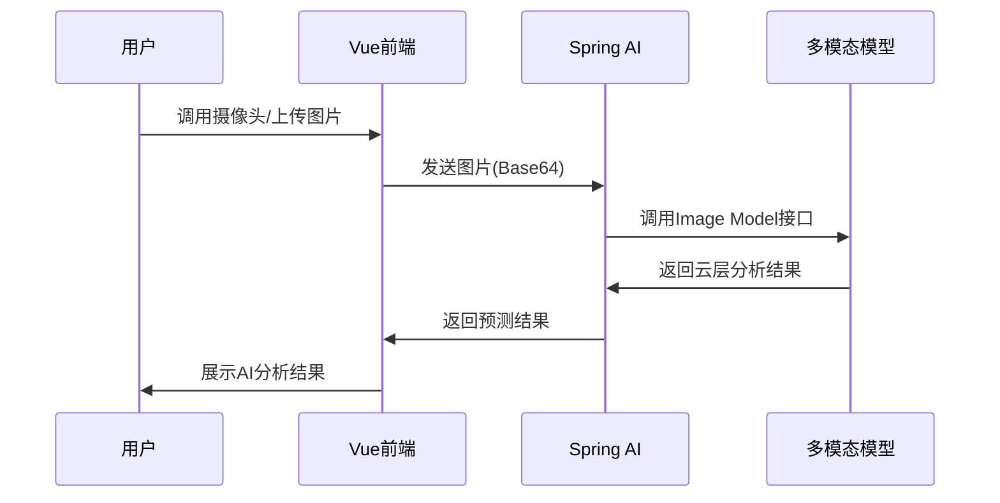
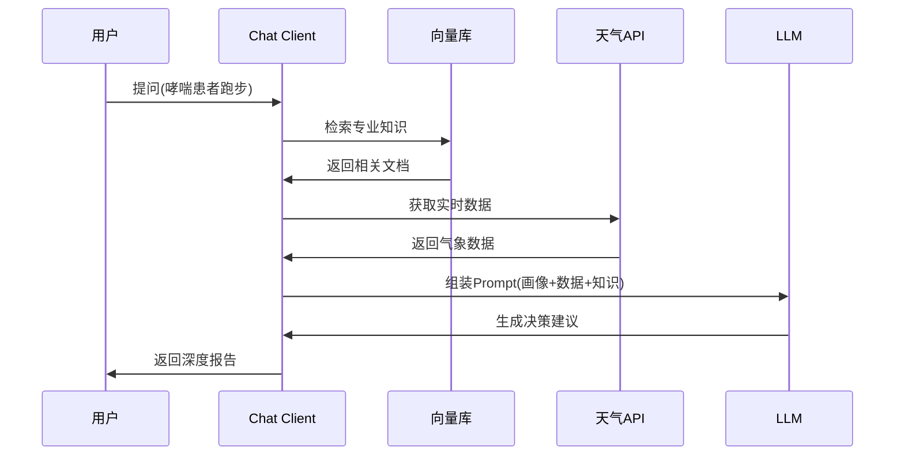

# 参赛作品方案：「智观天象」
## 基于Spring AI的多模态智能天气预测与决策系统

---

## 目录
- [1. 作品摘要](#1-作品摘要executive-summary)
- [2. 需求分析与痛点解决](#2-需求分析与痛点解决problem--solution)
- [3. 系统架构设计](#3-系统架构设计system-architecture)
- [4. 核心创新功能详解](#4-核心创新功能详解key-features-for-competition)
- [5. 数据库与数据流设计](#5-数据库与数据流设计-精简版)
- [6. 比赛演示脚本规划](#6-比赛演示脚本规划-demo-script)
- [7. 技术难点与解决方案](#7-申报材料中的技术难点与解决-technical-challenges)
- [8. 比赛注意事项](#8-比赛注意事项)

---

## 1. 作品摘要(Executive Summary)

「智观天象」是一款突破传统气象数据展示局限的智能决策系统。本项目基于Spring Boot 3与Vue 3构建，核心创新在于引入Spring AI框架，实现了"数据+文本+图像"的多模态融合。

系统不仅能提供精准的气象预报，更能通过用户上传的天空照片进行云层识别与短临预测，利用大语言模型（LLM）生成个性化的防灾减灾决策建议和生活出行指南。本作品旨在解决传统天气预报"看不懂、用不上、互动差"的痛点，打造懂用户的智能气象助手。

### 参赛亮点

- **多模态交互**：支持"拍照问天气"，利用视觉大模型分析云图
- **决策而非仅展示**：从"明天有雨"升级为"明天有雨，建议携带折叠伞并推迟户外婚礼"
- **架构先进性**：采用最新的Spring AI抽象层，屏蔽不同大模型厂商差异，易于扩展
- **零部署负担**：采用容器化模拟与本地轻量级运行方案，适合比赛现场演示

---

## 2. 需求分析与痛点解决(Problem & Solution)

| 用户痛点 | 传统方案缺陷 | 「智观天象」解决方案 |
|---------|------------|-------------------|
| 数据晦涩 | 只有温度、湿度数字，普通人难理解体感 | AI自然语言解读：将数据转化为"体感闷热，如同蒸桑拿"等通俗描述 |
| 缺乏互动 | 只能查，不能问（如："这周末适合露营吗？"） | 智能问答机器人：基于RAG（检索增强生成）技术，结合实时数据回答复杂场景问题 |
| 视觉缺失 | 无法直观判断当前天空状况对未来的影响 | 多模态识图：用户上传天空照片，AI分析云状（积雨云/层云），辅助判断未来1小时降雨概率 |
| 建议通用 | 穿衣建议千篇一律，不考虑个人体质或活动 | 个性化决策：结合用户画像（老人/儿童/运动）生成定制化避险或出行方案 |

---

## 3. 系统架构设计(System Architecture)

### 3.1 技术栈选型(比赛专用版)

为了比赛演示的稳定性与便捷性，简化运维复杂度，强调核心逻辑。

#### 前端技术栈
- Vue 3 + TypeScript
- Pinia (状态管理)
- ECharts (数据可视化)
- Mapbox GL (动态气象地图)

#### 后端技术栈
- Spring Boot 3.2+
- Spring AI (核心创新点)
- Spring Security (JWT)

#### AI模型层
- **文本/决策**：接入国内大模型API (如阿里通义千问/百度文心一言)或通过Ollama运行本地轻量模型(Qwen-7B/ChatGLM3)以展示离线能力
- **视觉分析**：集成多模态模型(如Qwen-VL或GPT-4V)进行云图识别

#### 数据层
- MySQL (业务数据)
- Redis (缓存热点天气数据)
- Vector Store (Pgvector或内存版) (用于存储气象知识库，实现RAG)

#### 外部数据源
- 和风天气API / OpenWeatherMap (免费额度即可满足演示)

### 3.2 核心功能模块图

```
┌─────────────────────────────────────────────────────────────┐
│                      前端展示层 (Vue 3)                       │
│  ┌──────────┐  ┌──────────┐  ┌──────────┐  ┌──────────┐   │
│  │ 气象大屏  │  │ 智能问答  │  │ 云图识别  │  │ 个人中心  │   │
│  └──────────┘  └──────────┘  └──────────┘  └──────────┘   │
└─────────────────────────────────────────────────────────────┘
                              ↓
┌─────────────────────────────────────────────────────────────┐
│                    后端服务层 (Spring Boot 3)                 │
│  ┌──────────┐  ┌──────────┐  ┌──────────┐  ┌──────────┐   │
│  │ REST API │  │ Spring AI│  │ Security │  │ SSE推送  │   │
│  └──────────┘  └──────────┘  └──────────┘  └──────────┘   │
└─────────────────────────────────────────────────────────────┘
                              ↓
┌─────────────────────────────────────────────────────────────┐
│                       AI模型层                               │
│  ┌──────────────┐  ┌──────────────┐  ┌──────────────┐     │
│  │ 文本生成模型  │  │ 多模态模型    │  │ 向量检索模型  │     │
│  │ (Qwen/GLM)   │  │ (Qwen-VL)    │  │ (Embedding)  │     │
│  └──────────────┘  └──────────────┘  └──────────────┘     │
└─────────────────────────────────────────────────────────────┘
                              ↓
┌─────────────────────────────────────────────────────────────┐
│                       数据层                                 │
│  ┌──────────┐  ┌──────────┐  ┌──────────────────────┐     │
│  │  MySQL   │  │  Redis   │  │  Vector Store        │     │
│  │ (业务数据)│  │ (缓存)   │  │  (知识库/RAG)        │     │
│  └──────────┘  └──────────┘  └──────────────────────┘     │
└─────────────────────────────────────────────────────────────┘
```

---

## 4. 核心创新功能详解 (Key Features for Competition)

### 4.1 功能一：多模态"拍天问雨" (Multimodal Sky Analysis)

#### 场景描述
用户看到天空乌云密布，不确定是否会下雨。

#### 实现流程



#### Prompt模板
```
请分析这张天空图片中的云层类型（如积雨云、层积云），
结合当前地理位置（从元数据获取），
预测未来 1-2 小时的降雨概率，
并给出简短建议。
```

#### 展示效果示例
> "检测到高浓积雨云，预计 30 分钟后有雷阵雨，请立即寻找避雨处"

---

### 4.2 功能二：基于 RAG 的场景化决策顾问 (RAG-based Decision Agent)

#### 场景描述
用户询问"我是哮喘患者，明天去公园跑步合适吗？"

#### 实现流程



#### 输出示例
> "不推荐。明日花粉浓度极高且伴随大风，易诱发哮喘，建议改为室内运动"

---

### 4.3 功能三：动态气象叙事报告 (Dynamic Weather Storytelling)

#### 创新点
拒绝枯燥表格，利用LLM将未来7天的数据编写成生动的"天气周报"。

#### 风格选项
- 严谨新闻风
- 幽默段子风
- 古风诗词风

#### 示例输出
**古风模式：**
> "明日杭城雨纷纷，断桥残雪待君行..."

---

## 5. 数据库与数据流设计 (精简版)

由于不需要上线，重点展示数据流转的逻辑性。

### 5.1 数据表设计

#### 气象事实表 (fact_weather)
存储清洗后的标准气象数据。

| 字段名 | 类型 | 说明 |
|-------|------|------|
| id | BIGINT | 主键 |
| location | VARCHAR(100) | 地理位置 |
| temperature | DECIMAL(5,2) | 温度 |
| humidity | DECIMAL(5,2) | 湿度 |
| wind_speed | DECIMAL(5,2) | 风速 |
| weather_condition | VARCHAR(50) | 天气状况 |
| record_time | DATETIME | 记录时间 |

#### 向量知识库 (vector_knowledge)
存储气象科普、灾害应对指南、生活指数规则。

| 字段名 | 类型 | 说明 |
|-------|------|------|
| id | BIGINT | 主键 |
| content | TEXT | 知识内容 |
| embedding | VECTOR(1536) | 向量嵌入 |
| category | VARCHAR(50) | 分类 |
| created_at | DATETIME | 创建时间 |

#### 交互日志表 (log_interaction)
记录用户的提问、上传的图片哈希、AI的回答。

| 字段名 | 类型 | 说明 |
|-------|------|------|
| id | BIGINT | 主键 |
| user_id | BIGINT | 用户ID |
| question | TEXT | 用户提问 |
| image_hash | VARCHAR(64) | 图片哈希 |
| answer | TEXT | AI回答 |
| created_at | DATETIME | 创建时间 |

---

## 6. 比赛演示脚本规划 (Demo Script)

这是比赛得分的关键，设计一个3-5分钟的完美演示流程。

### 演示流程表

| 步骤 | 操作动作 | 预期效果/解说词 |
|-----|---------|---------------|
| 1. 全景概览 | 打开首页大屏，展示动态地图和实时数据卡片 | "评委好，这是系统首页，集成了全国气象态势，数据毫秒级刷新。" |
| 2. 智能问答 | 在对话框输入："我计划后天带老人去杭州西湖游玩，有什么注意事项？" | 系统迅速调取杭州天气、景点人流预测，结合"老人"标签，输出包含穿衣、防滑、休息点的详细攻略。（展示 RAG 能力） |
| 3. 多模态识图 | 点击"拍一拍"，上传一张预先准备好的"乌云密布"照片 | 系统识别出"积雨云"，警告"未来 40 分钟暴雨风险 90%"，并弹出红色预警动画。（展示多模态能力） |
| 4. 风格切换 | 在设置中将 AI 语气切换为"古风模式"，再次询问天气 | AI 用诗词歌赋的形式播报天气："明日杭城雨纷纷，断桥残雪待君行..." （展示 Prompt 工程灵活性） |
| 5. 代码展示 | 快速切到 IDE，展示 Spring AI 的简洁调用代码 | "我们利用 Spring AI 统一了模型接口，仅需几行代码即可切换底层大模型，体现了架构的先进性。" |

---

## 7. 申报材料中的"技术难点与解决" (Technical Challenges)

在申报书中填写此部分可显著加分。

### 难点一：大模型响应速度慢，影响用户体验

**解决方案：**
- 采用SSE (Server-Sent Events) 流式输出技术
- 让文字像打字机一样逐字显示，降低用户等待焦虑
- 对常用问题建立本地缓存

**代码示例：**
```java
@GetMapping(value = "/chat/stream", produces = MediaType.TEXT_EVENT_STREAM_VALUE)
public Flux<String> streamChat(@RequestParam String question) {
    return chatClient.stream()
        .prompt(question)
        .call()
        .content();
}
```

---

### 难点二：大模型容易产生"幻觉"，编造不存在的天气数据

**解决方案：**
- 采用Function Calling (工具调用) 机制
- 强制模型在回答天气数值前，必须先调用后端提供的 getWeatherData 工具获取真实数据
- 严禁模型自行捏造数值

**代码示例：**
```java
@Bean
@Description("获取指定城市的实时天气数据")
public Function<WeatherRequest, WeatherData> getWeatherData() {
    return request -> weatherService.getWeather(request.getCity());
}
```

---

### 难点三：多模态图片分析成本高、延迟大

**解决方案：**
- 在前端增加预处理，仅在用户明确触发"识图"时调用
- 后端对图片进行压缩处理
- 设置超时熔断机制，保证系统不卡死

**代码示例：**
```java
public AnalysisResult analyzeSkyImage(MultipartFile image) {
    // 图片压缩
    BufferedImage compressed = ImageCompressor.compress(image, 800, 600);
    
    // 设置超时
    return CompletableFuture.supplyAsync(() -> 
        visionModel.analyze(compressed)
    ).orTimeout(10, TimeUnit.SECONDS)
     .exceptionally(ex -> AnalysisResult.timeout());
}
```

---

## 8. 比赛注意事项

### 8.1 UI设计要点

> **UI 颜值即正义**：比赛评委第一眼看到的是界面。

- 务必使用高质量的 UI 组件库（如 Element Plus 的深色模式或自定义主题）
- 地图要动态好看
- 不要只放数字，用ECharts做雷达图（紫外线、湿度、风力综合评分）
- 用动态粒子效果展示风向

### 8.2 准备Plan B

> 现场演示时如果公网大模型 API 超时，提前准备好备用方案。

**备用方案：**
- 提前准备好录屏视频
- 在本地跑一个极小的开源模型（如通过 Ollama 跑 Qwen-1.8B）作为备用
- 证明系统架构是通的

### 8.3 强调"Spring AI"

> 在答辩中多次提及使用了 Spring AI 框架。

- 这表明你们紧跟 Java 生态的最新趋势（Spring AI 是 2023-2024 年的新热点）
- 比直接调 HTTP 接口显得更有技术含量

### 8.4 数据可视化建议

- 用ECharts做雷达图（紫外线、湿度、风力综合评分）
- 用动态粒子效果展示风向
- 不要只放数字

---

## 附录：快速启动指南

### 环境要求
- JDK 17+
- Node.js 18+
- MySQL 8.0+
- Redis 6.0+
- Ollama (可选，用于本地模型)

### 启动步骤

```bash
# 1. 启动后端
cd backend
mvn spring-boot:run

# 2. 启动前端
cd frontend
npm install
npm run dev

# 3. 启动Ollama (可选)
ollama run qwen:7b
```

### 访问地址
- 前端：http://localhost:5173
- 后端API：http://localhost:8080
- API文档：http://localhost:8080/swagger-ui.html

---

**文档版本：** v1.0  
**创建日期：** 2026-03-26  
**适用场景：** 比赛演示、项目申报、技术答辩
